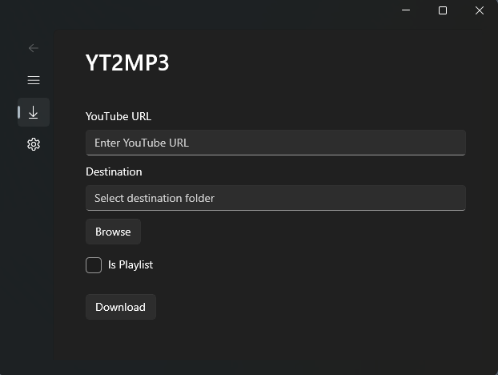

# YT2MP3

YT2MP3 is a WinUI 3 desktop application built using C#. This app is built around `yt-dlp` to download audio from YouTube using and `ffmpeg` to handle audio types. The app is designed around the Windows 11 Mica theme and is intended to simplify the `yt-dlp` experience.

<p align="center">
  
</p>

## Features

- **YouTube Audio Download**: Input a YouTube URL and download the audio directly to your local machine.
- **Playlist Support**: Option to download entire playlists with a single click.
- **Destination Selection**: Choose where you want to save the downloaded audio files.
- **Modern UI**: Built using WinUI 3, leveraging the Mica design for a sleek Windows 11 look and feel.

## Prerequisites

- **Visual Studio 2022** with the following workloads installed:
  - `.NET Desktop Development`
  - `Desktop Development with C++` (for WinUI)
- **yt-dlp**: The app uses `yt-dlp` to download YouTube content. The app includes a PowerShell script to install or update `yt-dlp` automatically.
- **ffmpeg**: The app uses `ffmpeg` for high quality audio conversion. The app includes a PowerShell script to install `ffmpeg` automatically.

## Installation

1. **Clone the Repository**:
    ```bash
    git clone https://github.com/0zean/YT2MP3.git
    cd YT2MP3
    ```

2. **Open the Solution**:
    - Open `YT2MP3.sln` in Visual Studio 2022.

3. **Build the Project**:
    - Ensure all dependencies are restored, and build the solution.

4. **Install yt-dlp and ffmpeg**:
    - Run the `InstallUtils.ps1` PowerShell script to install or update `yt-dlp` and `ffmepg`.

5. **Run the App**:
    - Start the application by pressing `F5` in Visual Studio.

6. **Optionally Install the App**:
    - By right-clicking the `.csproj` file in Visual Studio, you can select "Package and Publish" -> "Create App Packages" to generate an MSIX installer to install the app on your PC.

## Usage

1. **Input YouTube URL**: Enter the URL of the YouTube video or playlist in the provided input field.
2. **Select Destination**: Choose the folder where you want to save the downloaded audio files.
3. **Playlist Option**: Check the playlist checkbox if the provided URL is a playlist.
4. **Download**: Click the download button to start the process.

## Built With

- **C#**
- **WinUI 3**

## Contributing

Contributions are welcome! Please follow these steps:

1. Fork the repository.
2. Create a new branch (`git checkout -b feature/your-feature`).
3. Commit your changes (`git commit -m 'Add your feature'`).
4. Push to the branch (`git push origin feature/your-feature`).
5. Open a pull request.

## License

This project is licensed under the GLP3 License - see the [LICENSE](LICENSE) file for details.

## Acknowledgements

- [yt-dlp](https://github.com/yt-dlp/yt-dlp) for making the downloading process easy.
- [ffmpeg](https://www.ffmpeg.org/) for audio conversion.
- Microsoft for the WinUI 3 platform.
- <a href="https://www.flaticon.com/free-icons/installer" title="installer icons">Installer icons created by riajulislam - Flaticon</a>

## Support

If you find this project helpful, please give it a ⭐ on GitHub!
